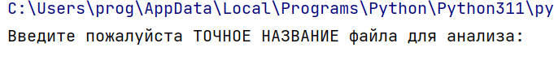
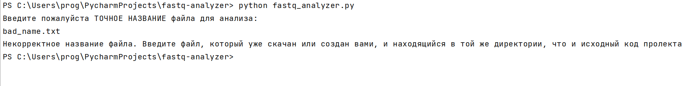
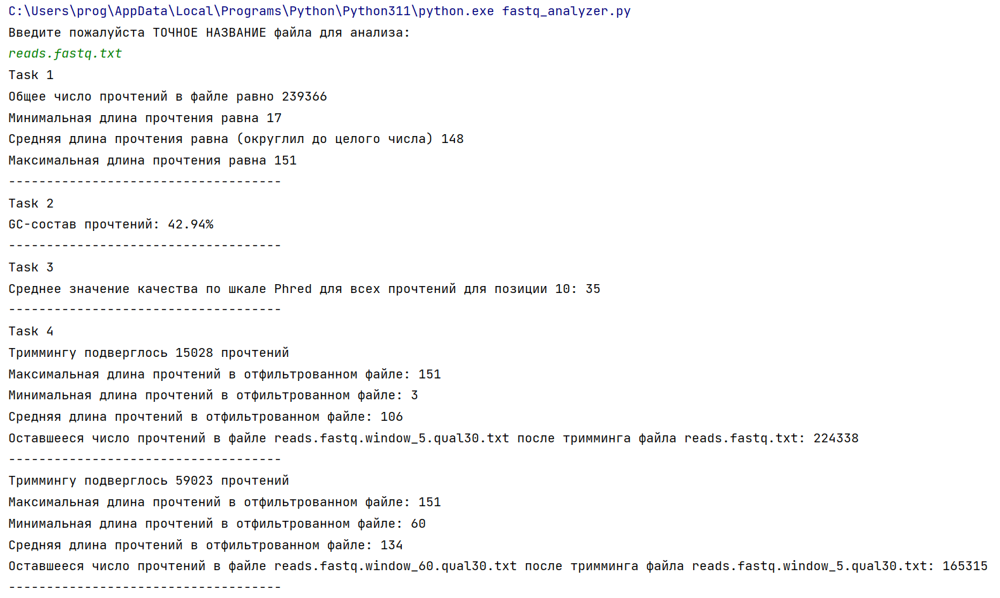

# FASTQ Analyzer & Trimmomatic Emulator

Набор инструментов на Python для парсинга, базового контроля качества данных секвенирования и фильтрации прочтений (тримминга) в формате FASTQ.

Проект создан в рамках курса по биоинформатике (Университет ИТМО). Направление: 01.03.02. Компьютерные технологии. 2026.

Преподаватель: Иванов Артём Борисович

Работу выполнил: Родыгин Павел Дмитриевич - студент 2-го курса КТ, группа M3237

## 🧬 Описание функционала

Скрипт выполняет анализ и обработку FASTQ-файлов без использования сторонних биоинформатических библиотек (таких как Biopython).

Реализованы следующие блоки:
1. **Basic QC (Контроль качества):**
   - Подсчет общего количества прочтений.
   - Вычисление минимальной, максимальной и средней длины прочтений.
   - Расчет общего GC-состава (%).
   - Вычисление среднего значения качества (Phred-33) для 10-ой позиции нуклеотидов.
2. **Quality Trimming (SLIDING WINDOW):**
   - Точная реализация алгоритма скользящего окна. Реализация алгоритма придумывалась мной самостоятельно, однако некоторые вещи я реализовывал с опорой на Java-исходники оригинального инструмента [Trimmomatic](https://github.com/usadellab/Trimmomatic/blob/main/src/main/java/org/usadellab/trimmomatic/trim/SlidingWindowTrimmer.java), так как в алгоритме тримминга есть неочевидные детали.
   - Поддерживает динамическое обновление метаданных (`length=...`) в заголовках FASTQ после обрезки последовательности.
3. **Length Filtering:**
   - Фильтрация прочтений, длина которых после тримминга упала ниже заданного порога.

## ⚙️ Особенности реализации

Для достижения 100% совпадения с результатами классических биоинформатических тулов, в алгоритме `sliding_window_triming` учтены следующие нюансы:
*   Для исключения ошибок округления дробей, среднее качество окна не делится на его размер, а сумма Phred-качества окна сравнивается с заранее вычисленным порогом (`trimming_quality * sliding_window_size`).
*   При обнаружении "плохого" окна алгоритм не сразу отрезает "плохой кусок", а выполняет цикл `while`, двигаясь назад (справа налево) и удаляя одиночные нуклеотиды, качество которых ниже заданного.
*   Добавлена возможность взаимодействия пользователя с программой на минимальном уровне. При запуске, в самом начале, пользователю предлагается ввести название файла:
    
  
*   В случае неправильного ввода или указания несуществующего файла, пользователю будет выдано соответсвующее сообщение об ошибке.
    
  

## Результаты работы. Статистика

Без лишних слов просто прикрепляю скриншот работы программы и всех логов.



## 🚀 Запуск и использование

Скрипт использует только стандартную библиотеку Python. Запустить код на исходном [файле](https://ctlab.itmo.ru/~aivanov/ct_algo_2026/reads.fastq) (предварительно: ОБЯЗАТЕЛЬНО нужно скачать файл для тримминга (или просто иметь свой исходник) и прикрепить его в директорию, где запускаете код), можно с помощью команды:
```bash
python fastq_analyzer.py
